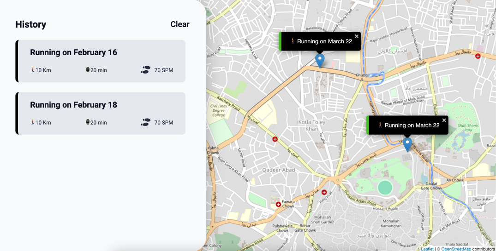

# Workout Tracker

This simple workout tracker allows users to log their running and cycling exercises, view their workout history, and see their routes on a map. It features functionalities such as adding new workouts, displaying workout details, and clearing workout history.

## Technologies Used

-   JavaScript
-   Leaflet.js for displaying maps
-   Local Storage for data storing

## Usage

To use the workout tracker:

1. Open the app in your web browser.
2. Allow location access to view your current position on the map.
3. Add a new workout by filling out the form with details like workout type, duration, and distance.
4. View your workout history below the map.
5. Click on a workout to see its details and move the map to the workout location.
6. Clear your workout history by clicking the "Clear History" button.
